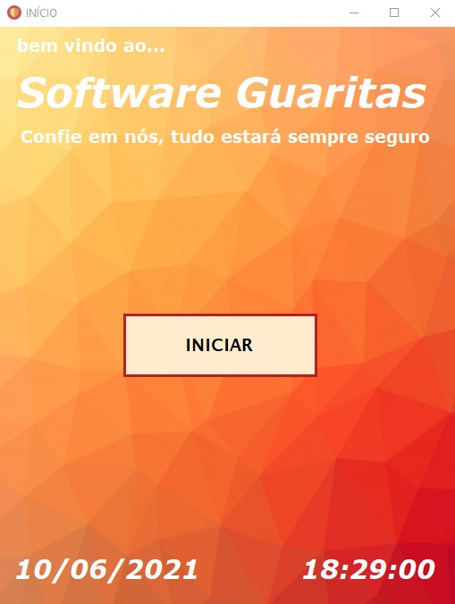

<!---->

# Software Guaritas - Gerenciamento de registros de entrada e saída

Esse projeto de TCC foi desenvolvido em grupo, pelo Grupo 04 do 3EIA, na <strong>ETEC Jardim Ângela</strong>, no final de 2020.  
Utilizando as linguagens de programção Visual Basic, e banco de dados Access.

